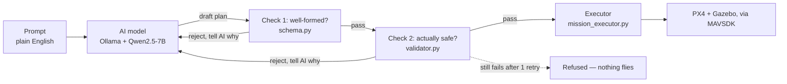

# Write-up: Prompt-to-Flight Drone Simulation Pipeline

**Candidate:** Keerthi
**Task:** Omokai Robotics — Simulation & Autopilot Take-Home
**Scope of this submission:** Core Task only, built over 1 week. The three
optional challenges (multi-agent formations, SLAM/navigation, vision target
follow) are planned separately — see Section 3 for approach.

---

## 1. Architecture

The AI only ever proposes a flight plan. It never controls the drone
directly. Plain code checks and approves every plan before it reaches the
drone.

### Why Ollama, and why a local model at all

The task needed to run end-to-end on an examiner's machine, on demand,
without a network dependency that could fail or need an API key shared
around. A cloud model would have made the whole pipeline depend on an
external account, billing, and internet reliability at exactly the moment
someone else is trying to grade it. Ollama runs the model entirely on the
machine it's installed on — once the image is built and the model pulled
once, the whole thing works offline. Qwen2.5-7B-Instruct was picked because
it's a reasonably capable open-weights model that a normal laptop CPU can
actually run without a GPU, which matched the project's own decision to
keep Gazebo headless (see below) rather than assume the examiner's machine
has a usable GPU set up inside Docker.

### Two checks, not one

Check 1 (`schema.py`) asks if a plan is shaped correctly — right fields,
hard outer limits that never change (altitude can't exceed 30m no matter
what). Check 2 (`validator.py`) asks if it's safe right now — geofence,
current altitude/speed limits, whether a loop actually closes. These are
config values, not hardcoded, so operational limits change without
touching code.

A plan asking for 12 m/s speed shows why the split matters: Check 1 allows
up to 15, so it passes. Check 2's actual limit is 8, so it gets caught
there instead. Same plan, two different questions, two different answers.

### The executor

`mission_executor.py` turns an approved plan into an exact MAVSDK command
sequence — arm, takeoff, fly to each point, repeat if it's a loop, return
home. It doesn't know or care whether an AI was involved. Every command it
sends gets logged in order, and a test runs the same plan through it twice
to confirm the two logs match exactly — proof of repeatability, not just a
claim of it.

### Refuse completely, don't auto-correct

If a plan fails a check, the system refuses outright and flies nothing,
rather than shrinking the request into something safe and flying that
instead. I considered the alternative — quietly adjusting an unsafe request
into a safe one — and decided against it, for a few reasons:

- If you ask for a 5km flight and the system quietly flies 30 metres
  instead, you have no idea your actual request was ignored. That's worse
  than a clear "no," because it looks like it worked.
- Deciding *how* to shrink a bad request into a safe one is itself a whole
  new piece of logic, with its own bugs waiting to happen.
- This is how real safety systems work elsewhere too — a plane or a factory
  robot given an out-of-range command gets refused, not silently
  reinterpreted into something else.

This is implemented and tested — `validate_mission_json()` returns a hard
fail with nothing executed, proven by an automated test and by
`demo_reject.py` — but it was never actually triggered by a live AI draft
during testing. Every time the AI was asked for something extreme, it
self-corrected on its own before the check needed to step in (more below).
So the policy is real and verified, just not something that came up
naturally in live use, which is exactly why `demo_reject.py` exists — to
show the refusal directly, without needing the AI to cooperate.

### A bug this caught before the first live flight

The safety settings use a made-up reference point purely for distance
math — it was never meant to be the drone's real spawn location. The
simulator spawns the drone somewhere else entirely. Sending a plan's raw
coordinates straight to the drone would have flown it thousands of km away.
Fixed by computing each waypoint as a distance-and-direction offset from
the plan's reference point, then re-applying that same offset from wherever
the drone actually spawned. Verified by a test that flies the same plan
from two different starting positions and checks the shape comes out
identical.

### One retry, not unlimited

If the AI's first draft fails a check, it's shown the exact error and gets
one more attempt — not an open-ended number of tries. In one real run, the
AI drew a proper 4-corner square but forgot the 5th point that repeats the
first corner to close the loop. Told exactly that, it fixed it correctly on
the second attempt.

### The AI self-correcting on its own

Asked for something invalid — "loop this -3 times" — the AI usually doesn't
write -3 and let the validator catch it. It just picks a valid number (e.g.
3) and moves on. Same pattern with deliberately extreme prompts like "fly a
5km wide loop" — it tends to quietly produce something small and safe
instead of attempting the extreme version. Net effect: the validator's
rejection path is rarely exercised by the AI directly, since the AI's own
caution gets there first.

Right now that self-correction happens silently — the operator never sees
that "-3" became "3." A better version would surface this back explicitly
("did you mean 3 instead of -3?") instead of quietly substituting a value
the operator never confirmed. Listed as a future improvement in Section 3.

### Seeing the simulation

The simulator runs headless by default — no GUI window, faster, no
graphics driver dependency, which matters when running on someone else's
machine for the first time. This is set via `HEADLESS=1` in the PX4 launch
command inside `fly.sh` (and `run_smoke_test.sh`). Changing that to
`HEADLESS=0`, or removing the flag entirely, opens the actual Gazebo window
so the flight is visible.

### Getting this to run the same way on a machine I don't control

A few problems came up specifically while making sure this behaves
consistently on any Linux machine, not just mine:

- `make px4_sitl gz_x500` launches an interactive console at the end. Using
  it as a Docker build step hung the build indefinitely with no error
  message, since nothing could answer that console. Fixed by using a
  compile-only build target instead.
- Backgrounding the simulator from an interactive terminal silently froze
  it. It was trying to read from a terminal it no longer had access to, and
  the OS paused the process instead of erroring out. Found by checking
  process state directly (`ps aux`, state `T` = stopped), fixed with
  `setsid` to fully detach it from any controlling terminal.
- Network installs auto-retry rather than failing outright — added after a
  real dropped connection partway through a long install.

### What isn't perfect yet

- Per-waypoint arrival confirmation sometimes appears to freeze mid-flight
  then catch up all at once. Missions still complete correctly, but the
  check itself isn't as reliable as intended — haven't fully root-caused it.
- Return-to-launch altitude is set to match the configured safety ceiling
  and measurably helps, but doesn't land on the exact number every time —
  PX4's own RTL logic seems to apply further adjustment beyond what's set.
- The AI runs on CPU, not GPU (20–45s per response) — a deliberate trade-off
  paired with the headless simulator, not an oversight.
- Nothing currently stops the AI from drawing a pattern that's too small,
  only too large.

---

## 2. What was attempted

Core task only, all four stages built, tested, and run live successfully.
None of the three optional challenges started yet — see Section 3.

| Problem | Resolution |
|---|---|
| Prove simulator + flight software talk to each other first | Hardcoded throwaway flight script, no AI, no checks |
| Need a strict contract before an unpredictable AI produces input | Built and tested both checks against 10 hand-written example plans, before writing any AI code |
| Prove a plan always flies identically | Executor tested in dry-run mode with no live drone, comparing two runs of the same plan |
| Plan flying to the wrong real-world location | Worked out offset math by hand, verified with a cross-location test |
| AI drawing unclosed shapes | Rewrote AI instructions to explicitly require a repeated closing waypoint, with a worked example |
| Build hanging with no error | Traced to an interactive console with nothing to answer it |
| Live run silently freezing | Traced via process state inspection, fixed with terminal detachment |
| Manual multi-step process, easy to get wrong | One script that checks what's already running before starting anything new |

---

## 3. Approach to the optional challenges

**Multi-agent formations.** The existing check-then-fly pattern stays the
same, just runs once per drone. New work: a layer that splits a squad-level
instruction into one plan per drone, plus a minimum-separation safety rule.

**SLAM / autonomous navigation.** Replace fixed waypoints with live
navigation goals as the drone builds its own map. The safety check would
need to change from a fixed geofence circle to checking against whatever's
actually been mapped so far.

**Vision detection and follow.** A camera feed, a lightweight detector for
an operator-specified object type, and a new "follow" mode instead of
following fixed points — with an explicit fallback (hover or return home)
if the target is lost.

**Beyond the demo:**
- AI running fast enough for real use, with a defined fallback if it's ever
  unavailable — never silently skipping safety checks.
- Permanent, searchable flight logs, not just terminal output.
- Real flight-area boundaries instead of a fixed circle.
- Access control over who can send commands to a given drone.
- An explicit "did you mean X?" clarification step for ambiguous or
  self-corrected AI output, instead of the silent substitution described in
  Section 1.
- Automated regression tests against a fixed set of prompts, including
  adversarial ones, run on every code change — AI behavior can drift
  between versions in ways manual testing won't reliably catch.

---

## 4. Sources

| Tool | Source | License |
|---|---|---|
| PX4 (v1.16.2) | github.com/PX4/PX4-Autopilot | BSD-3-Clause |
| MAVSDK-Python | github.com/mavlink/MAVSDK-Python | MIT |
| Gazebo Harmonic | gazebosim.org | Apache-2.0 |
| Ollama | github.com/ollama/ollama | MIT |
| Qwen2.5-7B-Instruct | huggingface.co/Qwen/Qwen2.5-7B-Instruct | Apache-2.0 |

Read for architecture ideas, nothing copied from either:

- **ChatDrones** — github.com/Gaurang-1402/ChatDrones — reference for "AI
  produces structured commands, code checks before anything moves."
- **ros2-agent-ws** — github.com/limshoonkit/ros2-agent-ws — reference for
  wiring a local LLM alongside PX4 + ROS 2, relevant to Section 3's
  navigation plan.

**Own past work:** none reused — built from scratch for this project.
