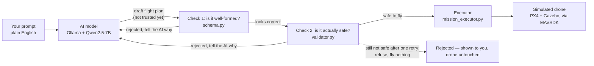

# Write-up: Prompt-to-Flight Drone Simulation Pipeline

**Candidate:** Sruthi
**Task:** Omokai Robotics — Simulation & Autopilot Take-Home
**This submission covers:** the Core Task only, built and tested over 5 days.
The brief allows up to a week for the core task and up to three weeks total
including the optional challenges. Those three challenges (multi-agent
formations, SLAM/navigation, vision target follow) are planned for the
remaining time and will come as a separate follow-up submission. Section 3
below explains how I'd approach each one, as the brief asks for even before
they're built.

---

## 1. How it's built, and why

### 1.1 The one rule everything else follows

The AI is only ever allowed to *suggest* a flight plan. It never controls
the drone directly. Nothing it produces reaches the drone until plain code —
not the AI — has checked it and approved it.

Why this matters: you can never fully guarantee an AI model won't suggest
something like "fly to 10,000 metres" or "loop negative five times," no
matter how carefully you word the instructions you give it. So instead of
trying to make the AI perfectly well-behaved, the system puts a hard
checkpoint between "the AI's idea" and "what the drone actually does," and
everything past that checkpoint is ordinary, predictable code that behaves
the same way every time.

### 1.2 Two separate checks, not one

The first check just asks: *is this shaped correctly?* Right fields, right
types, no missing pieces, and a few limits that never change (altitude can
never be above 30 metres, no matter what).

The second check asks a different question: *is this actually safe to fly,
right now, from here?* Things like: is it too far from home, is the altitude
too high for today's rules, does a loop actually come back to where it
started. These limits are settings, not hardcoded — if the flying area
changes tomorrow, you change a setting, not the code.

Splitting these into two checks matters because a flight plan can be
perfectly well-formed and still be unsafe. One example that actually
happened during testing: a plan asking for 12 metres/second speed. That's
allowed by the first check (it only blocks anything over 15), but the
second check catches it, because the actual safety limit set for this
project is 8.

### 1.3 The part that actually flies the drone

Once a plan passes both checks, `mission_executor.py` takes over. It turns
the plan into a series of exact commands: arm, take off, fly to each point,
repeat if it's a loop, come home. It has no idea an AI was ever involved —
it just takes a plan and flies it, the same way every time.

Every command it sends gets written down in order, so there's always a
record of exactly what was done. To prove "the same plan always produces the
same flight," a test runs the same plan through the executor twice and
checks the two recordings match exactly.

### 1.4 A decision worth explaining: refuse completely, don't "fix it a little"

When a plan fails the safety check, the system doesn't try to shrink it down
into something safe and fly that instead. It just refuses, with a clear
reason, and flies nothing.

I considered the alternative — quietly adjusting an unsafe request into a
safe one — and decided against it, for a few reasons:

- If you ask for a 5km flight and the system quietly flies 30 metres
  instead, you have no idea your actual request was ignored. That's worse
  than a clear "no," because it looks like it worked.
- Deciding *how* to shrink a bad request into a safe one is itself a whole
  new piece of logic, with its own bugs waiting to happen.
- This is how real safety systems work elsewhere too — a plane or a factory
  robot given an out-of-range command gets refused, not silently
  reinterpreted into something else.

### 1.5 A real bug this caught: flying to the wrong place entirely

The safety settings use a made-up reference point, purely for measuring
distances — it was never meant to be the drone's actual real-world location.
But the simulator spawns the drone somewhere else entirely. If the system
had just sent a plan's raw coordinates straight to the drone, it would have
tried to fly it thousands of kilometres away.

The fix: instead of using the plan's coordinates directly, the executor
works out *how far and in what direction* each point is from the plan's
reference position, then re-applies that same distance and direction from
wherever the drone actually is. Same shape, correctly placed. This was
caught by working through the maths by hand before the first real flight,
then double-checked with a test that flies the same plan from two
completely different starting positions and confirms the shape comes out
identical both times.

### 1.6 Letting the AI try again, but only once

If the AI's first attempt fails a safety check, it gets shown the exact
reason why and one chance to fix it — never an unlimited number of tries.

In practice this worked well: one real run had the AI draw a proper square
using 4 corners, but forgot that a closed loop needs a 5th point repeating
the first corner to actually close the shape. It was told exactly that, and
fixed it correctly on the second try.

Separately, and more interesting: when asked to do something extreme on
purpose (like "fly a giant loop 5 kilometres wide"), the AI usually didn't
even try — it just quietly produced something small and reasonable instead.
That's a good sign about the AI's own judgement, but it means the safety
check rarely gets to actually block the AI directly. A short script
(`demo_reject.py`) exists separately, to show the safety check refusing a
bad plan on its own, without needing the AI to cooperate by doing something
risky.

### 1.7 Getting this to run reliably on a machine I don't control

A few real, non-obvious problems came up while making sure this runs the
same way on any Linux machine, worth mentioning because they were genuinely
tricky to track down:

- One of the simulator's startup commands actually launches an interactive
  console at the end, not just a background process. Using it as a build
  step made the whole build hang forever, silently, with no error — because
  there was nothing to answer the console's prompts. Fixed by using a
  build-only version of the same command.
- Running the simulator in the background from a normal terminal caused it
  to freeze without any error message. The cause: it was trying to read
  keyboard input from a terminal it no longer had access to, and the
  operating system paused it rather than crashing it. Found by checking the
  process's status directly, and fixed by fully detaching it from the
  terminal.
- The install steps are set up so a network hiccup automatically retries
  instead of failing the whole build — added after actually hitting a
  dropped connection partway through a long install.

### 1.8 What isn't perfect yet, said plainly

- The system checks the drone has actually reached each point before moving
  on, but that check sometimes seems to freeze mid-flight and then catch up
  all at once. It doesn't stop the mission from finishing correctly, but
  the check itself isn't as reliable as intended, and I haven't fully
  figured out why yet.
- The "return home" altitude is set to match the configured safety limit,
  and it clearly helps (the drone climbs less high than it used to before
  the fix), but it doesn't land exactly on the number every time — the
  simulator's own return-to-home logic seems to make its own adjustments
  beyond what was set.
- The AI runs on the computer's processor instead of its graphics card, so
  each response takes 20–45 seconds. This was a deliberate trade-off (the
  simulator was set up to not need graphics either, for easier setup on any
  machine) rather than something overlooked.
- Left with no specific size in a prompt, the AI sometimes draws a very
  small shape (a few metres across). Nothing currently stops it from going
  too small, only from going too big.

---

## 2. What was attempted

Only the core task was built and tested. None of the three optional
challenges (multi-agent formations, SLAM/navigation, vision target follow)
were started yet — that was a deliberate choice, to get one thing working
properly rather than four things half-working. Section 3 explains the plan
for each.

The genuinely hard parts of the core task, and how each got solved:

| Problem | How it was solved |
|---|---|
| Making sure the simulator and flight software actually talk to each other, before building anything on top | Wrote one throwaway script that just flies a hardcoded path, no AI, no checks — purely to prove the basics work first |
| Needing a strict contract before letting an unpredictable AI produce input | Wrote and fully tested the two safety checks against 10 hand-written example flight plans, before writing any AI code at all |
| Making sure a flight plan always flies the same way | Built the executor with a test mode that skips the real drone but produces the same recorded output — used to prove two runs of the same plan match exactly |
| A flight plan flying to the wrong real-world spot | Worked out the position-correction maths by hand, then wrote a test that checks it from two different starting points |
| The AI drawing shapes that don't properly close | Rewrote the AI's instructions to explicitly require one extra repeated point at the end, with a worked example |
| A build that hung with no error | Traced it to an interactive console with nothing to answer it, fixed by separating "build" from "launch" |
| A test that froze with no error | Traced it by checking the process status directly, fixed by fully detaching it from the terminal |
| A multi-step manual process that was easy to get wrong | Wrote a single script that checks what's already running before starting anything new, so it's safe to run repeatedly |

---

## 3. How I'd tackle the optional challenges

### 3.1 Multiple drones working together

The existing safety-check-then-fly pattern doesn't need to change — it
would just run once per drone. The new work is a layer above it that takes
a squad-level instruction ("you three sweep this area") and splits it into
one flight plan per drone, each going through the exact same checks as
today. Also new: a rule making sure drones don't fly too close to each
other, added as another safety setting.

### 3.2 Flying somewhere the drone doesn't have a map of yet

Right now the drone flies to points that are already known in advance. For
an unknown space, the fixed points would be replaced with live navigation:
the drone builds a map as it goes (using a mapping technique called SLAM)
and is given goals instead of exact coordinates. The safety check would
also need to change — instead of a fixed circle on a map, it would need to
check against whatever the drone has actually mapped so far.

### 3.3 Seeing and following something

This breaks into three fairly separate pieces: a camera feed from the
simulated drone, a lightweight detector looking for a type of object the
user specifies, and a new flying mode that follows what it sees instead of
following fixed points — with a clear, safe fallback (like just hovering or
flying home) if it loses sight of the target.

### 3.4 Beyond the demo, toward something real

A few things that would matter for actual real-world use, beyond a
simulation:
- Running the AI on real hardware fast enough, with a backup plan if it's
  ever unavailable — never quietly skipping the safety checks if it is.
- Keeping a permanent, searchable record of every flight, not just what
  shows up in a terminal.
- Using real, official flight-area boundaries instead of a simple made-up
  circle.
- Deciding who's even allowed to send flight instructions to a given drone.
- A large set of test prompts, including deliberately tricky ones, that get
  run automatically every time the code changes — because AI behaviour can
  shift between versions in ways that manual testing alone won't reliably
  catch.

---

## 4. Sources

### Tools used as-is (not modified, properly credited)

| What | Where from | License |
|---|---|---|
| PX4 flight software (version 1.16.2) | github.com/PX4/PX4-Autopilot | BSD-3-Clause |
| MAVSDK-Python (talks to the flight software) | github.com/mavlink/MAVSDK-Python | MIT |
| Gazebo Harmonic (the simulator) | gazebosim.org | Apache-2.0 |
| Ollama (runs the AI model locally) | github.com/ollama/ollama | MIT |
| Qwen2.5-7B-Instruct (the AI model itself) | huggingface.co/Qwen/Qwen2.5-7B-Instruct | Apache-2.0 |

### Repos read for ideas, nothing copied

- **ChatDrones** — github.com/Gaurang-1402/ChatDrones — read to see how
  someone else structured "AI produces structured commands, code checks
  them before anything moves." The actual checking code here is written
  from scratch, not based on this repo's code.
- **ros2-agent-ws** — github.com/limshoonkit/ros2-agent-ws — read as a
  reference for wiring a locally-run AI model alongside PX4 and ROS 2,
  relevant to the navigation plan in section 3.2, even though ROS 2 isn't
  used in the core task itself.

### Own past work

None reused — everything here was built from scratch for this project.
